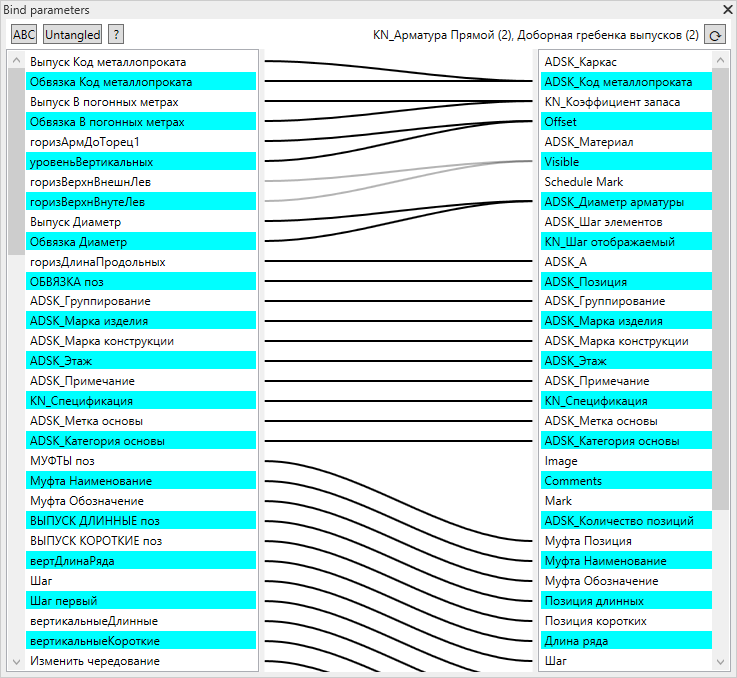

# Revit FamilyGuy
[Русский](README.ru.md)

Alternative interface of family to element parameters binding Revit add-in.
## Overview
Parameters binding is very uncomfortably in Revit family editor. You need three mouse clicks and probably scroll a parameters list to bind the parameters. You can't observe parameter bindings without many mouse clicks.

Add-in speed up editing of complex linked families.

## Using
Show/Hide parameters binding window: Add-Ins -> Family Guy -> Bind parameters 
Left panel - family parameters, formulas in parameter hints 
Right panel - selected elements parameters 
Gray lines - if not all parameters of selected elements are bound
### Features
- Bind parameters - drag one parameter to another
- Unbind parameter - double click
- Copy parameter's formula to clipboard - right click
- Alphabetically/Default family parameters sort
- Sort parameters to prevent tangling
## Install
- Change library references if you work in Revit version other then Revit 2019
- Build library in Visual Studio
- Copy FamilyGuy.dll and FamilyGuy.addin in %appdata%\Autodesk\Revit\Addins\2019 folder