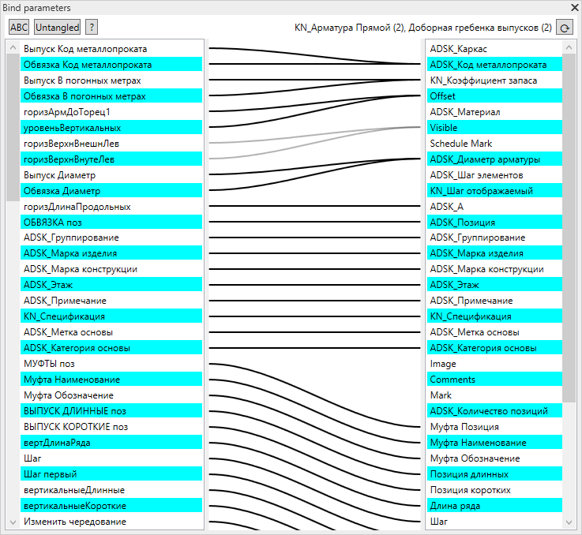

# Revit FamilyGuy
[English](README.md)

Плагин для ревита предлагающий альтернативный интерфейс связывания параметров семейства с параметрами элементов семейства.
## Обзор
Привязка параметров в редакторе семейств очень неудобна. Нужно сделать три клика мышью, и возможно, прокрутить список, чтобы связать параметры. Просмотр существующих связей, тоже не очень нагляден и требует кликов для просмотра каждой привязки.

Плагин значительно ускоряет редактирование сложных семейств с множеством связей.

## Использование
Окно связывания параметров показывается/убирается кнопкой: Надстройки -> Family Guy -> Bind parameters

В окне, слева - параметры семейства, справа - параметры выделенных элементов. Связи параметров показаны линиями. Серым цветом - когда не все параметры выделенных объектов связаны с этим параметром семейства. В подсказках к параметрам семейства содержится формула параметра.
### Возможности
- связывание параметров - перетаскивание левой кнопкой мыши параметра один на другой
- отвязывание параметров - двойной щелчок по параметру
- копирование формулы параметра семейства в буфер обмена - правый клик мыши
- сортировка параметров семейства по алфавиту/по умолчанию
- сортировка параметров семейства так, чтобы линии связей меньше пересекались
## Установка
- В проекте поменять пути к библиотекам ревита если вы работаете не в Revit 2019
- Собрать библиотеку в Visual Studio
- Скопировать собранную FamilyGuy.dll и FamilyGuy.addin в папку %APPDATA%\Autodesk\Revit\Addins\2019